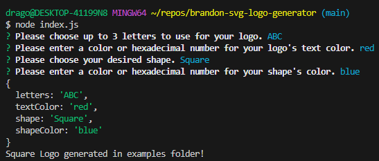
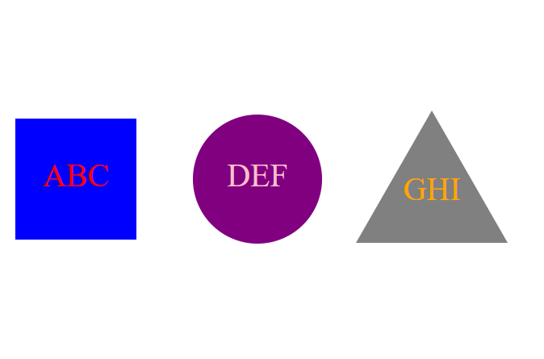
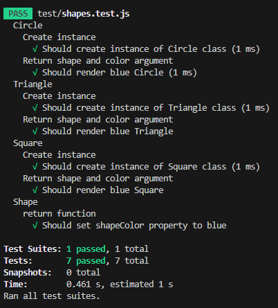

# brandon-svg-logo-generator

[Video Demonstration](https://youtu.be/J79dXDz0VtA)

## Table of Contents

- [Description](#description)
- [Installation](#installation)
- [Usage](#usage)
- [License](#license)
- [Questions](#questions)

## Description

As a developer, it is important to be able to create logos for whatever needs you may have. For this project, we created svg logos using Node.js and the command line. The inquirer package is also used in this project to ask questions, as well as jest for testing purposes. Users have the option to choose from three shapes, circles, triangles, and squares for their logo. Up to three letters can be used for the logo, as well as choosing background and text color. This project has been another good example of using data imported from external files. Writing tests has also gotten much easier to understand, and how useful tests can be in other projects.

## Installation

1. Clone the repository from GitHub.
2. Install or have Node.js installed.
3. Open the cloned repository in VSCode.
4. Open the project inside the integrated terminal.
5. Install all package dependencies using the `npm i` command.

## Usage

1. Use the command `node index.js` in the integrated terminal to run the program.
2. Color for the text and shape can be entered as either the color name or hexademial value. (ex. #008000 is green)
3. Answer all of the questions with relevant information.
4. Look over the information that is logged to the console to verify that it is correct.
5. The `Shape.svg` file will be available to use in the examples folder.
6. Save the project using `Ctrl + Shift + S`.

### Example of Terminal

### Example Logos

## License

Licensed using [MIT](https://opensource.org/license/mit/)

## Tests

Tests are performed using the `jest` package. Jest allows users to test all functions of their code, and make sure that everything works. These make it easier keep track of errors/bugs. All tests can be found under `shapes.test.js` in the `test` folder. Creating new instances, and rendering for all shapes were used to test different parts of the project.

### Tests Example

## Questions

You are welcome to contact me with questions using the following:

- [GitHub Profile](https://github.com/bwing2)

- [Email](mailto:brandon.wing245@gmail.com)
